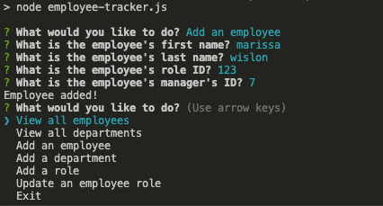

# bchw12-EmployeeTracker

## Table of Contents

* [Description](#description)
* [Installation](#installation)
* [Usage](#usage)
* [Screenshots](#screenshots)
* [Credits](#credits)
* [Questions](#questions)
* [License](#license)

## Description
This application allows the user to keep track of their employees, departments, roles and salaries. This information is stored to a mySQL database.

The deployed application can be accessed via the following link: 

## Installation
Git clone this repository and NPM install inquirer to use.

## Usage
Create a mySQL database by using the prewritten code in the employee-tracker.sql file. Run this code in mySQL workbench.

Once you have created the database in mySQL, type "node employee-tracker.js" in the integrated terminal (in this repository) to start up the application, and answer the prompts through the terminal to add/change inputs to the database.

## Screenshots

## Credits
Individual work by me, Marissa Wilson, with the help of...

* Instructors Fil and Daniel
* Boolean Bros
* Class activities in module 12 (utor folder)

## Questions
For any questions regarding this project, I can be reached at wilson.marissarose@gmail.com.

For additional information, please visit my GitHub profile here:
[GitHub](https://github.com/marissarrwilson)

## License
Copyright (c) [2020] [Marissa Wilson]

Permission is hereby granted, free of charge, to any person obtaining a copy of this software and associated documentation files (the "Software"), to deal in the Software without restriction, including without limitation the rights to use, copy, modify, merge, publish, distribute, sublicense, and/or sell copies of the Software, and to permit persons to whom the Software is furnished to do so, subject to the following conditions:

The above copyright notice and this permission notice shall be included in all copies or substantial portions of the Software.

THE SOFTWARE IS PROVIDED "AS IS", WITHOUT WARRANTY OF ANY KIND, EXPRESS OR IMPLIED, INCLUDING BUT NOT LIMITED TO THE WARRANTIES OF MERCHANTABILITY, FITNESS FOR A PARTICULAR PURPOSE AND NONINFRINGEMENT. IN NO EVENT SHALL THE AUTHORS OR COPYRIGHT HOLDERS BE LIABLE FOR ANY CLAIM, DAMAGES OR OTHER LIABILITY, WHETHER IN AN ACTION OF CONTRACT, TORT OR OTHERWISE, ARISING FROM, OUT OF OR IN CONNECTION WITH THE SOFTWARE OR THE USE OR OTHER DEALINGS IN THE SOFTWARE.